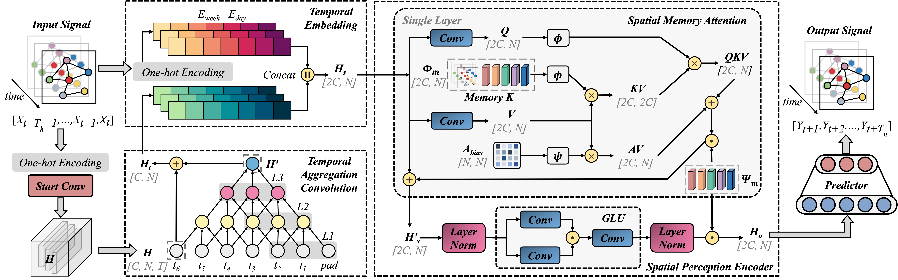
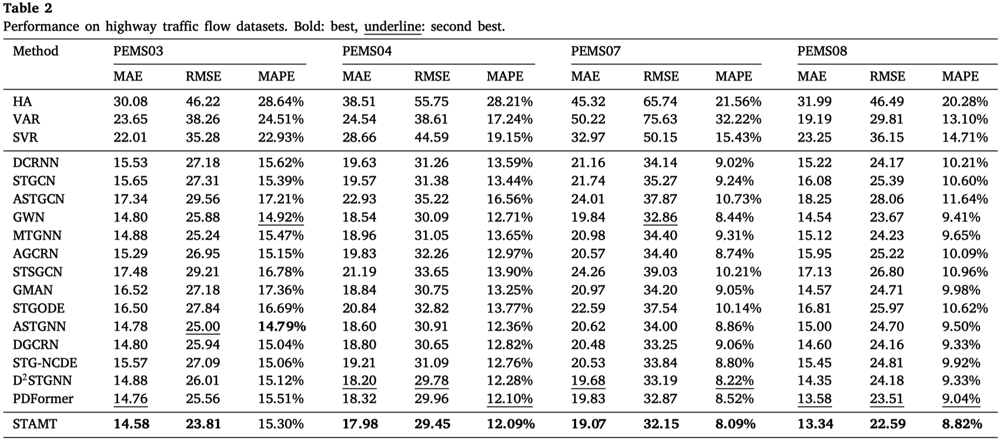
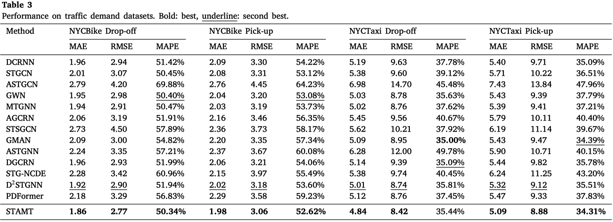
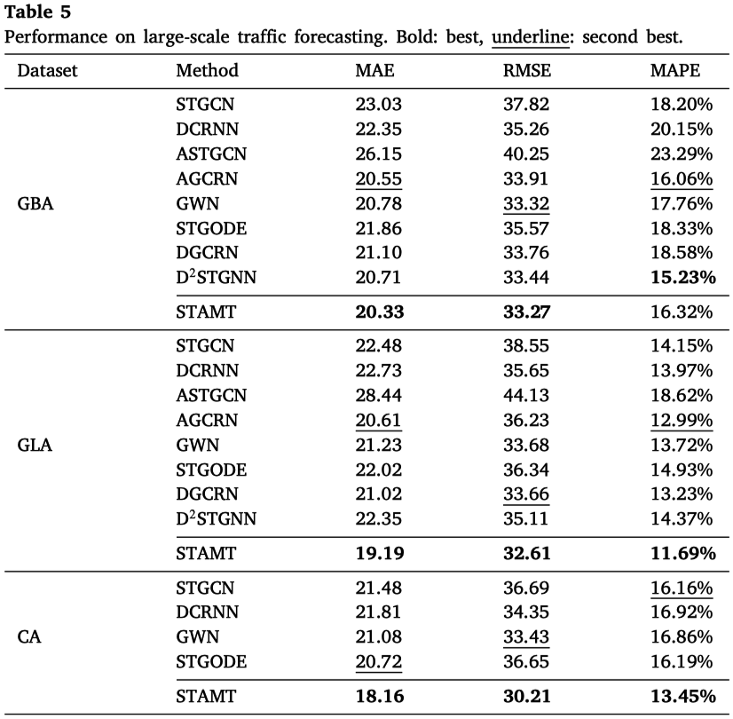

# STAMT
This is the pytorch implementation of STAMT. I hope these codes are helpful to you!

[STAMT is accepted by ESWA (Expert Systems with Applications).](https://doi.org/10.1016/j.eswa.2024.123884)

<p align="center">
  
</p>

## Requirements
The code is built based on Python 3.9.12, PyTorch 1.11.0, and NumPy 1.21.2.

## Datasets
The relevant datasets are made publicly available and can be found in one of our [recent research efforts](https://github.com/LiuAoyu1998/STIDGCN) accepted by the IEEE Transactions on Intelligent Transportation Systems.

We also provide preprocessed datasets that you can access [here](https://drive.google.com/drive/folders/1-5hKD4hKd0eRdagm4MBW1g5kjH5qgmHR?usp=sharing). If you need the original datasets, please refer to [STSGCN](https://github.com/Davidham3/STSGCN) (including PEMS03, PEMS04, PEMS07, and PEMS08) and [ESG](https://github.com/LiuZH-19/ESG) (including NYCBike and NYCTaxi). Please obtain the large dataset (GBA, GLA and CA) from [LargeST](https://github.com/liuxu77/LargeST). We express our sincere gratitude to the providers of all the aforementioned datasets.

## Train Commands
It's easy to run! Here are some examples, and you can customize the model settings in train.py.
### PEMS08
```
nohup python -u train.py --data PEMS08 > PEMS08.log &
```
### NYCBike Drop-off
```
nohup python -u train.py --data bike_drop > bike_drop.log &
```
## Results
<p align="center">

</p>
<p align="center">

</p>
<p align="center">

</p>
